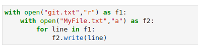
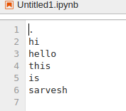

# copy-file
## AIM:
To write a python program for copying the contents from one file to another file.
## EQUIPEMENT'S REQUIRED: 
PC
Anaconda - Python 3.7
## ALGORITHM: 

## PROGRAM:
```
with open("git.txt","r") as f1:
    with open("MyFile.txt","a") as f2:
        for line in f1:
            f2.write(line)
 ```           


### OUTPUT:


MyFile.txt  =  
 

git.txt =



copied file = 


## RESULT:
Thus the program is written to copy the contents from one file to another file.